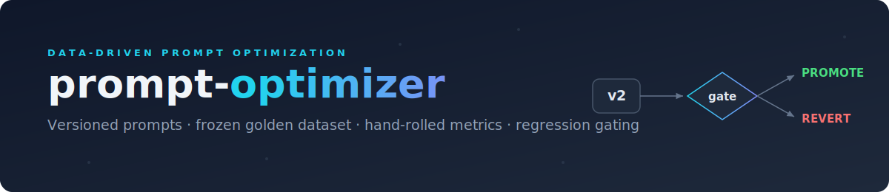

<p align="center">
  
</p>

Data-driven prompt optimization pipeline for a Voice-of-Customer classification task: versioned prompts are evaluated against a frozen golden dataset, scored with hand-rolled classification metrics, and passed through a regression gate that promotes or reverts each candidate. Framework-free — direct Groq SDK calls only.

## How it works

Each prompt lives as a versioned YAML file (`prompts/vN.yaml`) with a content fingerprint. A run sends every dataset example to the model, parses the response into one of six labels — `bug_report`, `feature_request`, `billing_issue`, `ux_complaint`, `performance_issue`, `praise` — and records a full `RunRecord`: per-example predictions, metrics (overall plus easy/hard slices), token/cost/latency totals, and both the prompt and dataset fingerprints. Unparseable responses become an explicit `PARSE_FAILURE` rather than being dropped, so they stay visible in every metric.

A candidate is compared against the current baseline by the gate, which promotes it only if **all** of these pass:

| Rule | Default |
| --- | --- |
| Macro-F1 gain over baseline | ≥ 0.005 |
| Worst per-class F1 drop | ≤ 0.05 |
| Parse success rate | ≥ 0.99 |
| Cost vs. baseline | ≤ 1.5× |
| Latency vs. baseline | ≤ 1.5× |

Every rule emits a pass/fail reason line, so a decision is always explainable. The gate refuses to compare runs made on a different dataset or model — it raises rather than silently producing a meaningless verdict. The baseline pointer (`runs/baseline.json`) advances only on a promote.

## Setup

```bash
pip install -r requirements.txt
cp .env.example .env   # then set GROQ_API_KEY
```

Model is pinned to `llama-3.3-70b-versatile` at `temperature=0` for reproducibility.

## Usage

```bash
# Full pipeline: run a prompt, gate it against the baseline, promote or revert.
# The first run of any version bootstraps the baseline.
python main.py --prompt v1

# Evaluate a prompt and print its report without touching the baseline.
python -m src.runner --prompt v1

# Show the current baseline.
python -m src.gate

# Inspect the dataset (count, fingerprint, class/difficulty distribution).
python -m src.dataset datasets/voc_golden_v1.jsonl
```

Add `--dry-run` to any run command to exercise the whole path with a mock client — no API key or network required.

## Tests

```bash
pip install -r requirements-dev.txt
pytest
```

`scikit-learn` is a test-only dependency used to verify the hand-rolled metrics against a trusted reference; production code never imports it.
